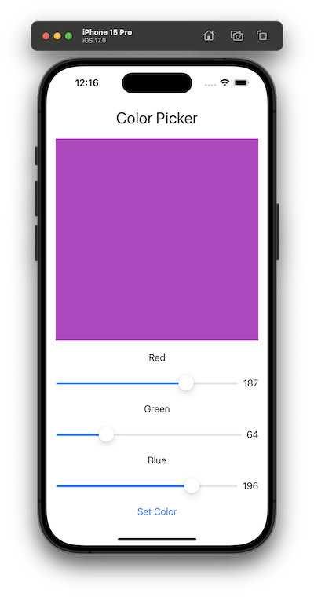

# Introduction

This app allows the user to select red, green and blue intensities to setup a color in a preview view.

It is the homework for the module 1 of [Kodeko iOS Bootcamp](https://bootcamp.kodeco.com/accelerator/ios).

<p align="center">
  
</p>

# Assignment

## Part 1

a) What does the command ‘git status’ output?

The state of the git repository where it is executed: 

- the branch
- the files that have been modified locally and not staged yet and the files that have been staged but not commited yet.
- the files that are not tracked yet 

b) In SwiftUI, anything that gets drawn on the screen is a **View**.

c) print(“Hello world”) is an example of a **function** call.

viewModel.getData() is an example of a **method** call.

d) Name some Views you have seen so far in SwiftUI.

- Text view
- Slider view
- Button view

e) How do you create a new local repository using git? (Feel free to answer with how you use git, i.e. terminal or another app)

In the terminal with the following command:

`git init`

f) How do you preview your app in multiple orientations?

In the canvas with the orientation variants for a swift ui view or in the simulator

g) An app is made up of **definitions** of classes and structs that contain **properties** and **methods**.


h) Name two components of a SwiftUI Button.

- the label of the button that will be displayed
- a closure that will contain the action to execute when the button is tapped

i) In git, what is the difference between a local repository and a remote repository?

The local repository is a folder in our computer that contains the code we can modify until we commit them.

The remote repository is a location on a server where developers can synchronize their modifications to a same codebase. After commiting changes in a local repository, we usually push those modifications at some point in a remote repository. 

j) Give an example of camel case.

helloWorld

k) What is a branch in git, and how do you create one? (Feel free to answer with how you use git, i.e. terminal or another app)

A branch is a parallel track of work where developers can work in isolation to make modifications to their code.

Here is how to create and access one from the terminal:

```shell
git branch hello
git switch hello
```

l) What are some common mistakes that can lead to errors while programming?

- syntax errors


m) VStack, HStack, and ZStack are **container** views used for **building layouts**.


n) How do you list the branches on your local repository? (Feel free to answer with how you use git, i.e. terminal or another app)

From the terminal:

```shell
git branch
```

o) What happens when @State variable changes in SwiftUI?

The view is redrawned to take into account the new state value.

p) What is the Single Responsibility Principle?

It is a principle saying that a module can only have one and only one reason to change. The idea is that a module should not have too many responsibilities to keep the code easy to maintain.

q) What will the print statement below produce?

var name = “Ozma”

print(“Hello, \(name)!”)

**Hello, Ozma**

r) What commands can you use in git to download data from a remote repository? What commands can you use in git to send data to a remote repository? (Feel free to answer with how you use git, i.e. terminal or another app)

From the terminal:

- download data

```shell
git pull
```

- send data

```shell
git push
```

s) Why is a programming To-Do list important, and what is a minimum viable product?

The to-do list is important to help decompose complex tasks into smaller ones that are simpler and easier to focus on.

A MVP is a product that contains just enough features to satisfy customers in order to get users feedback to validate those features and improve the product.

t) What is a simple way of describing Binding in SwiftUI?

A binding create a two-way connection between an UI element and a class property. When the user interacts with the UI element, the property is updated appropriately and the other way around.

u) What command do you use in git to move changes from one branch to another? (Feel free to answer with how you use git, i.e. terminal or another app)

From the terminal, to move changes from the `hello` branch to my current branch:

```shell
git merge hello
```

v) What is the type of the variable defined below?

var a = 87

An integer.

w) What is the difference between var and let?

var is used to declare values that could change while let is used to declare constants only.

## Part 3

In ContentView, lines 1 and 2 show the definition of **state property**.

In ContentView, line 3 shows the definition of a **integer property**.

In ContentView, line 4 shows the definition of a **view property**.


In ContentView, line 5 shows an **instance** of Game calling the **method** points.


In ContentView, line 6 is the definition of the **method** doSomethingWithCounter().


In Game, lines a, b, and c show the definition of **integer properties**.


In Game, line d is the definition of the **method** points(sliderValue: Int).


Lines 3, a, b, and c are the **integer properties** and lines 6 and d are the **methods** of the structs.


